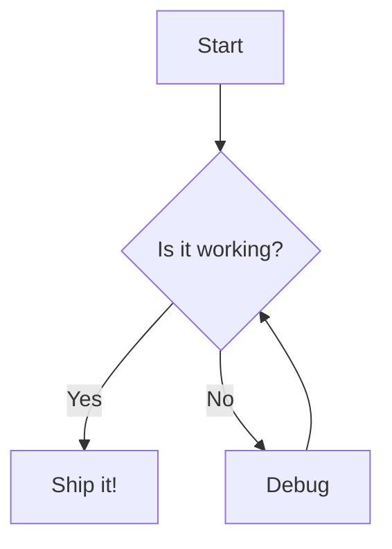
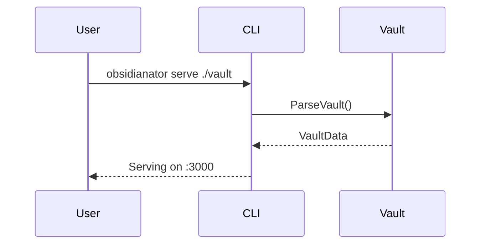
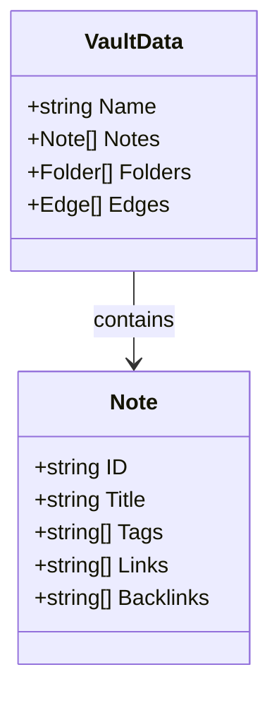
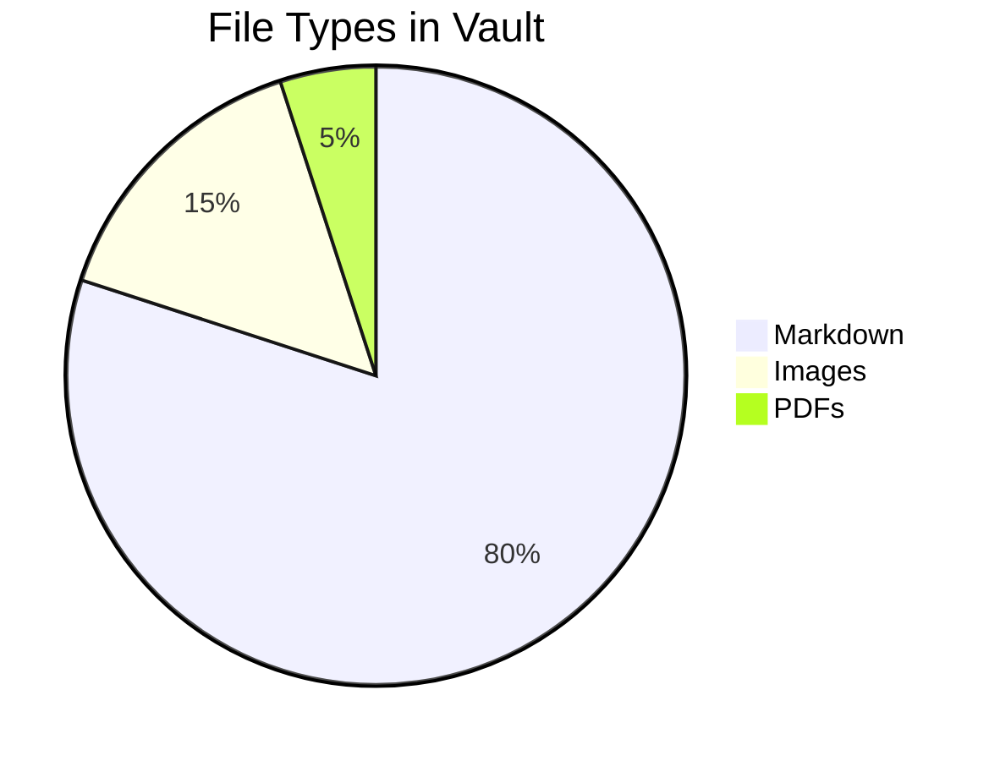

# Mermaid Diagrams

Mermaid lets you create diagrams from text. Obsidian renders `mermaid` fenced code blocks natively.

> [!WARNING] Not yet rendered
> Obsidianator does not yet render Mermaid diagrams — the code block will display as raw text until Mermaid support is added (see TODO.md).

## Flowchart

## Sequence Diagram

## Class Diagram

## Pie Chart

See also: [[Long Document]], [[Code Blocks]].
